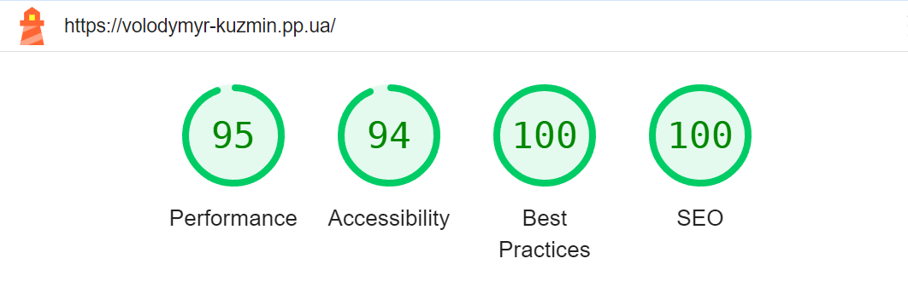
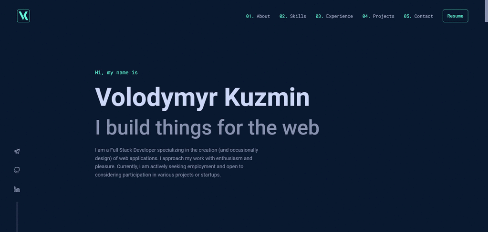

# My Personal Page

My personal page, it’s about me, my skills, my projects and getting in touch.

<h1><a href="https://volodymyr-kuzmin.pp.ua/">LIVE DEMO</a></h1>

# Technologies used

<ul>
  <li>HTML</li>
  <li>CSS</li>
  <li>Sass</li>
  <li>React</li>
  <li>TypeScript</li>
</ul>

# Features Overview

<ul>
  <li>Layout is adaptive and responsive. It works correctly on all screen sizes (mobile, tablet and desktop).</li>
  <li>Custom domain was connected to GitHub pages.</li>
  <li>An API has been created (Node.js, Express, Nodemailer) on a separate server for sending messages from the page.</li>
  <li>Semantic and OG meta tags are used.</li>
  <li>Schema Markup JSON-LD implemented.</li>
  <li>Images are optimized.</li>
</ul>

<em>See google lighthouse report below:</em>

  

# Preview

  

